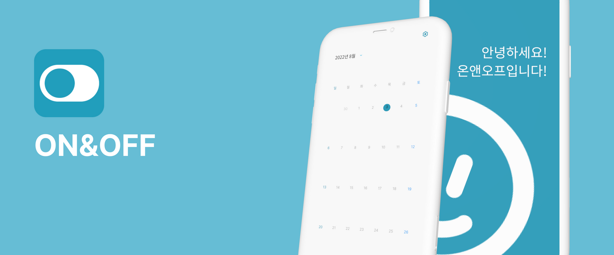
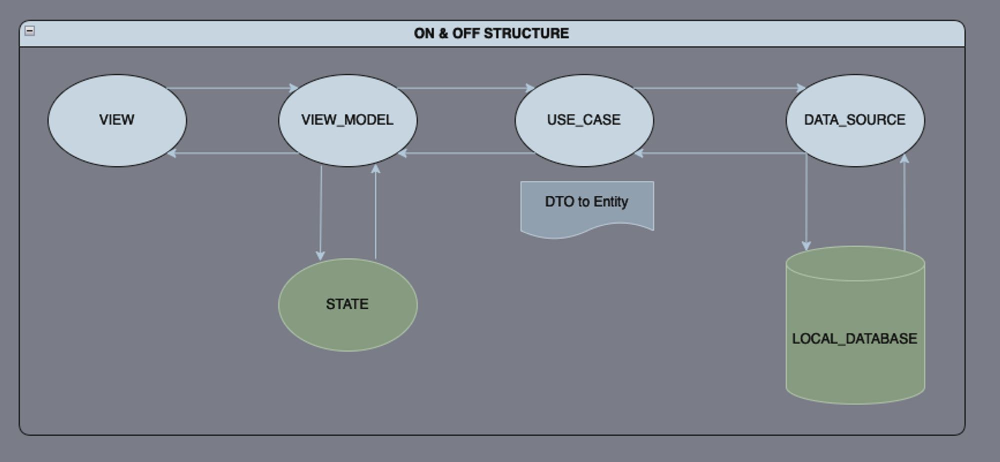
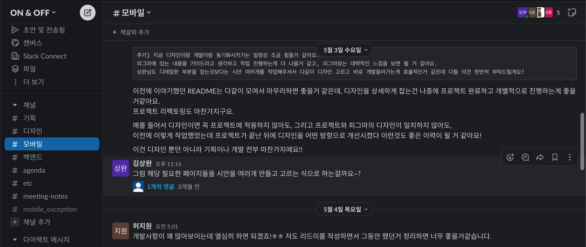
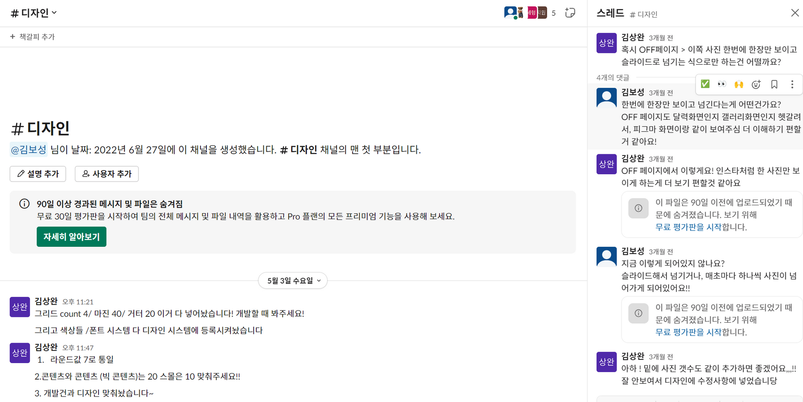
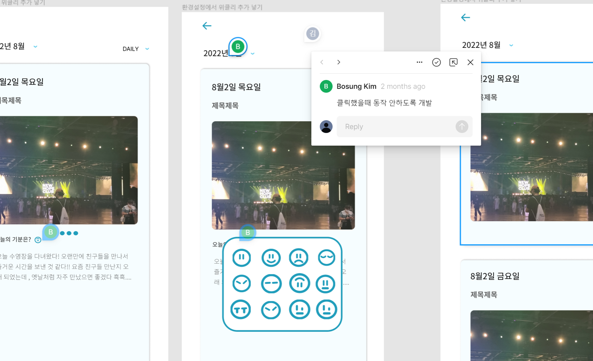
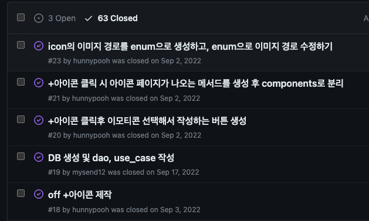
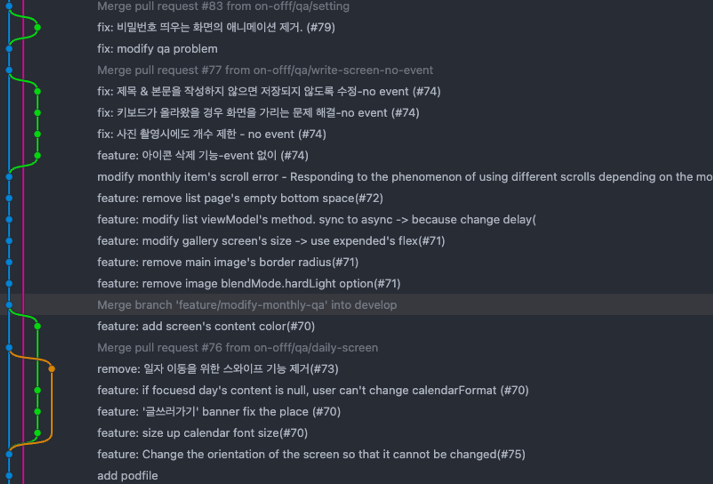
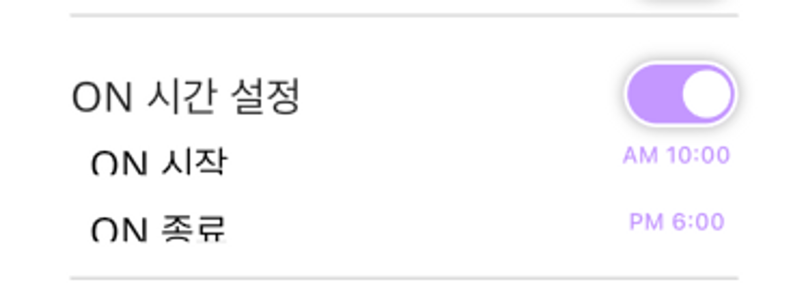
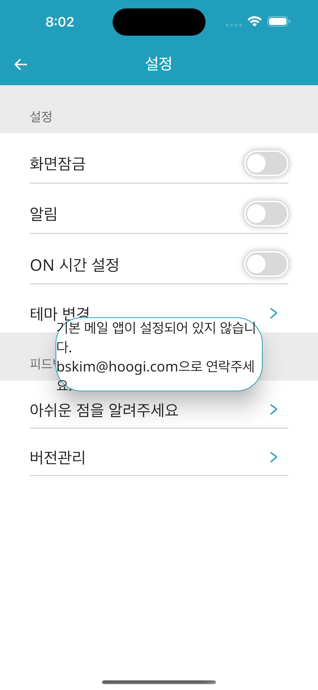
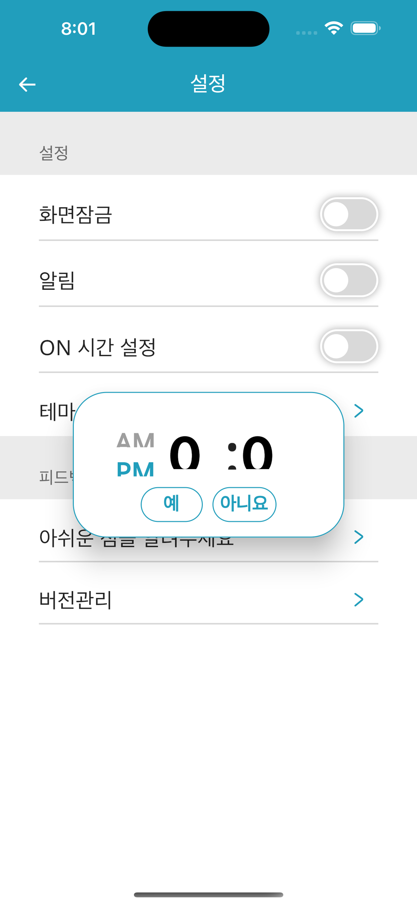

일과 일상을 분리해보세요!

 
  
  

## 주요 기능 소개

## 실행 화면

## 기술적 도전

### 클린 아키텍쳐 (MVVM)

단발성으로 끝나는 프로젝트가 아니라, 지속적으로 업데이트하며 같이 성장할 수 있는 프로젝트를 만들고자 했습니다. 사이드 프로젝트이다 보니 매일같이 보는 코드가 아니라서 더 깔끔하고 유지보수하기 쉬운 구조가 필요했습니다.
최대한 결합도를 낮출 수 있는 구조를 알아보았고, 최종적으로 MVVM 패턴이 적합하다는 판단이 들어서 적용하게 되었습니다.

#### 아키텍처

1. **MVC**
   우리가 찾아본 아키텍처 중 가장 단순하여, 당시Flutter를 이제 막 배우기 시작했던 우리에게 가장 적합했던 아키텍처였습니다.
   하지만 위에서 언급한 여러가지 이유로 이 프로젝트는 손쉽게 유지 보수 할 수 있는 구조가 중요했고, 다른 패턴들에 비해 상대적으로 어렵다는점 때문에 선택하지 않았습니다.
2. **MVP**
   MVC에 비해서 계층 분리가 명확해졌고 view와 model이 분리되었다는 특징이 있습니다. 찾아보면 view와 presenter가 1:1로 매핑되어 의존성이 높다는 단점을 많이 이야기하지만, ON & OFF의 특성상 그렇게 많은 화면이 필요하지 않을거같다는 생각이 들기도 하고 난이도가 상대적으로 낮다는점 때문에 가장 많이 고민했던 패턴입니다.
3. **FLUX**
   단방향 패턴으로, 의존도가 매우 많이 낮아지고 유지보수가 굉장히 편할거같다는 생각은 들었지만, 사실 당시 처음 Flutter를 개발하는 입장에서는 굉장히 어렵게 느껴졌기 때문에 선택하지 않았습니다.
4. **MVVM**
   찾아보는 당시 살짝 난이도가 있어보이는 패턴이었습니다. 하지만, 아래와 같은 여러가지 이유로 MVVM을 선택하게 되었습니다.

5. view와 model 간의 의존성이 없으며, viewModel 또한 view와 양방향이 아니라는 특징 등으로 다른 패턴과 비교했을때 유지 보수가 더 편리합니다.

6. 당시에 이미 Flutter에서 MVVM을 적용하는것에 대한 정보가 많이 있었고 간단한 예제들도 쉽게 찾아볼 수 있었기 때문에, 도입하는데 있어서 MVC 혹은 MVP와 비교하여 난이도가 높은건 큰 문제가 되지는 않다고 판단되었습니다.

7. 2번과 관련된 내용으로, 다른 패턴에 비해서 정보가 많았기 때문에 이슈가 발생했을 경우에 더 빠르게 확인하고 개선할 수 있을거라는 생각이 들었습니다.

위의 3가지 이유로 MVVM 패턴을 최종적으로 선택하게 되었습니다.

#### 구조

디렉토리 구조는 아래와 같이 크게 4가지 영역으로 나누었습니다.

1. di
   의존성 주입을 위한 패키지입니다.
2. data
   로컬 데이터베이스의 연동을 담당하고 있으며, 추후 API가 추가된다면 remote API 호출을 위한 영역으로, data_source가 포함되어 있습니다.
3. domain
   비즈니스 로직을 처리하기 위한 영역으로, model 및 entity와 use_case가 포함되어 있습니다.
4. ui
   화면을 그리기 위한 영역으로, view와 view_model이 포함되어 있습니다.

초기의 ON&OFF는 규모가 작았고, 만약 프로젝트의 규모가 커져 repository가 필요해졌을때 추가하는건 큰 문제가 되지 않을거라는 판단이 들어 빠른 개발을 위하여 어댑터의 역할을 하는 repository를 제외하였습니다.

## 협업 방식

거의 온라인 100% 진행한 거에도 불구하고, 슬랙/피그마 등으로 서로 회의를 통해 필요한 내용 및 진도를 정리하여 프로젝트를 진행하였으며, 완성을 하였습니다.

### Slack

### Figma

### Git flow

## 기술적으로 개선해야할 방향

### 옵저버 패턴 → 이벤트 버스 이용

ON & OFF는 달력을 이용했기 때문에, 사용자가 선택한 일자를 변경하면, setting 화면을 제외한 모든 viewModel에 적용되어야했습니다. 또한 다이나믹 테마를 적용할 계획이 있었기 때문에 이를 위한 공통 상태도 필요했구요.

이와 같이 공통으로 관리해야할 상태들이 몇가지 있었는데, 이를 위하여 옵저버 패턴을 도입하였습니다.

#### 옵저버 패턴의 문제

1. viewModel의 개수가 늘어날수록 상태가 변경될때마다 모든 viewModel을 돌면서 업데이트를 해야했기 때문에 성능이 악화되는게 확연히 보였고, 시간이 지날수록 상태를 변경시키는 작업에 대해서 더 조심스럽게 접근할 수밖에 없었습니다.
2. 또한, 공통 상태인 uiState에 대한 정보를 각 viewModel이 중복으로 가지고 있다보니 이를 동기화해주는 추가적인 작업이 많이 필요했다는 문제가 발생하였습니다.
   또한, 각 viewModel은 UiProvider에 접근이 불가능하여 uiState를 직접 변경하지 못했고, viewModel에서도 작업을 하고 해당 작업이 성공하면 UiProvider를 업데이트하는 복잡한 로직이 발생하는 경우가 적지않게 발생하였습니다.
3. 특정 화면을 초기화할때, uiState를 업데이트 해야하는 경우가 발생하여 uiProvider를 이용하여 작업을 해야하는 이슈가 있었습니다. 때문에 uiProvider가 공통 상태에 대한 관리 뿐만이 아니라, 각 route 들에 대한 정보들도 알게되어 가독성 및 유지 보수성이 많이 떨어졌습니다.

#### 어떻게 개선할 수 있을까?

많은 서칭을 해본 결과, 아직 적용은 안해봤지만 이벤트 버스를 이용하면 현재 옵저버 패턴을 이용하면서 발생하는 여러가지 문제를 해결할 수 있을것으로 예상됩니다.

[event_bus_plus | Dart Package](https://pub.dev/packages/event_bus_plus)

1. 성능: pub/sub 패턴을 사용하여 모든 viewModel을 업데이트하는것이 아닌 필요한 부분만 변경하므로 옵저버 패턴에 비하여 이점이 있을것으로 예상됩니다.
2. uiState를 각 viewModel이 가지고 있을 필요가 없어지기 때문에, 복사본을 중복으로 가짐으로써 발생하는 이슈가 줄어듭니다.

또한, 이벤트 기반 아키텍처를 학습할 수 있다는 장점도 있어 추후 프로젝트를 진행할 경우 적극적으로 도입을 고려할 예정입니다.

### 접근성 개선

현재 ON & OFF는 접근성이 고려되지 않은채 개발이 진행되었습니다.

다행히 글자 크기를 키우는 수준의 경우 메인 기능들의 경우에는 사용할 수 없는 수준은 아닙니다.
하지만 현재 ON & OFF에는 글자 크기가 고정되어 시스템 설정으로도 변경되지 않거나, 아니면 글자가 일부 짤려보이는 등의 현상이 발생하고 있습니다.

사실 초기에는 접근성이라는것이 있는지도 몰랐고, 개발하는데도 바빠서 신경쓰지 않고 개발했던 부분이라서 이점은 이후 프로젝트들에는 꼭 개선하고 싶은 부분입니다.

  
  
  

